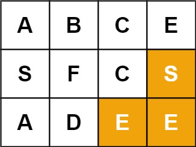

#### [17. 电话号码的字母组合](https://leetcode-cn.com/problems/letter-combinations-of-a-phone-number/)


#### [22. 括号生成](https://leetcode-cn.com/problems/generate-parentheses/)

#### [39. 组合总和](https://leetcode-cn.com/problems/combination-sum/)

#### [46. 全排列](https://leetcode-cn.com/problems/permutations/)


#### [78. 子集](https://leetcode-cn.com/problems/subsets/)

#### [79. 单词搜索](https://leetcode-cn.com/problems/word-search/)


#### 17. 电话号码的字母组合 

大成功！我居然自己做出来了，嘤嘤嘤QWQ

每次看到这个题目，我都直接跳转答案区了，因为它。。还有一个字符串的变换，我一看到就想跳过了，没想到啊。

今天思路突然清晰，就想着试一试了，没想到成了！

其实也是很容易的【x】

得到的一组电话号码，就一个一个地数嘛，比如`23`，那就先拿2里面对应的`abc`中的一个（这里应该循环，拿完就到下一层），然后再拿3对应的`def`，到达终止条件之后就回退！

---

其实我一开始写的时候，只知道它是回溯，就没想别的，就知道它是回溯，于是我就写出一个框框出来。


```java
class Solution {
    List<String> res = new ArrayList<>();
    String[] tele = new String[]{
        "abc", "def", "ghi", "jkl", "mno", "pqrs", "tuv", "wxyz"
    };
    public List<String> letterCombinations(String digits) {
        if(digits == null || digits.length() == 0){
            return res;
        } 
        backtrack();
        return res;
    }

    private void backtrack( ){ 
        // 终止
        if( ){ 
        }
        // 循环
        for(){
            
        }
    }
}
```

然后我就自己想想了，这个应该加什么参数呢？它需要的是一个个电话号码对应的字符串，所以应该比较长度，一旦加够了就停止。

这里我自己也踩了一个大坑，那用什么东西来放临时存储的结果呢？我直接一个无脑ArrayList……这里是字符串，而且还有拼接操作，应该用StringBuilder sb来放，因此比较它们两的长度。

此时，你也应该知道，`backtrack`函数中需要的参数之一就是sb

```java
if(sb.length() == digis.length())
```

接下来，就是需要遍历循环了，第一层很明显，就是digits。

```java
for(int i = index;i < digits.length();i++){
```

那个index是什么呢？其实是判断我到哪个字符了，比如`23`，我一开始应该先看2，然后再看3，我用这个index来确定到底是到2还是到3，这也是上面说到的一层一层地加，到第几层的意思。

然后……这里我就很想看答案了，因为感觉很陌生，虽然是有思路嘛但是就是不相信自己【x】

确定了遍历这个字符（2还是3），然后就该遍历2或者3对应的字符串啊，所以接下来该根据这个数字，从对应的符号表中查对应的字符串，然后遍历它。

要遍历的字符串

`String s = tele[digits.charAt(i) - '2'];`

然后开始遍历。

```java
for(int j = 0;j < s.length();j++){
    sb.append(s.charAt(j));
    backtrack(digits, sb, i + 1);
    sb.deleteCharAt(sb.length() - 1);
}
```

内层的遍历也不用管它，大概抽象一下，就……加了这个，然后就到下一层（指i+1，这个很重要！）

这样就写完了（？？？）

再连起来看看，你append之后，再回溯，这时进入下一层，然后再继续append，直到满足终止条件为止。

不错，下面是完整代码 。


```java
class Solution {
    List<String> res = new ArrayList<>();
    String[] tele = new String[]{
        "abc", "def", "ghi", "jkl", "mno", "pqrs", "tuv", "wxyz"
    };
    public List<String> letterCombinations(String digits) {
        if(digits == null || digits.length() == 0){
            return res;
        } 
        backtrack(digits, new StringBuilder(), 0);
        return res;
    }

    private void backtrack(String digits, StringBuilder sb, int index){
        // 终止条件
        if(sb.length() == digits.length()){
            res.add(sb.toString());
            return ;
        }
		
        for(int i = index;i < digits.length();i++){
            String s = tele[digits.charAt(i) - '2'];
            for(int j = 0;j < s.length();j++){
                sb.append(s.charAt(j));
                backtrack(digits, sb, i + 1);
                sb.deleteCharAt(sb.length() - 1);
            }
        }
    }
}
```


#### 22. 括号生成

2

> 数字 `n` 代表生成括号的对数，请你设计一个函数，用于能够生成所有可能的并且 **有效的** 括号组合。

回溯的解法好像还是有点套路的，具体还是会走遍所有的情况，但是就会一个一个地去尝试，添加它，然后再删掉它。

这里尝试先加左括号，然后再加右括号，直到括号数量足够为止。

```java
class Solution {
    List<String> ans = new ArrayList<>();
    public List<String> generateParenthesis(int n) {
        backtrack(new StringBuilder(), n, 0, 0);
        return ans;
    }


    private void backtrack(StringBuilder sb, int n, int left, int right){
        if(sb.length() == n * 2){
            ans.add(sb.toString());
            return ;
        }
        // 左括号比n小
        if(left < n){
            sb.append("(");
            backtrack(sb, n, left + 1, right);
            // 回溯！在遍历完之后删掉(左括号 
            sb.deleteCharAt(sb.length() - 1);
        }
        // 右括号比左括号小
        if(right < left){
            sb.append(")");
            backtrack(sb, n, left, right + 1);
            sb.deleteCharAt(sb.length() - 1);
        }
    }
}
```


#### 39. 组合总和 

给定一个**无重复元素**的数组 `candidates` 和一个目标数 `target` ，找出 `candidates` 中所有可以使数字和为 `target` 的组合。

`candidates` 中的数字可以无限制重复被选取。

**说明：**

- 所有数字（包括 `target`）都是正整数。
- 解集不能包含重复的组合。 

**示例 1：**

```
输入：candidates = [2,3,6,7], target = 7,
所求解集为：
[
  [7],
  [2,2,3]
]
```

**示例 2：**

```
输入：candidates = [2,3,5], target = 8,
所求解集为：
[
  [2,2,2,2],
  [2,3,3],
  [3,5]
]
```

---

这次我好像真的开窍了233333333选一个，加进候选队列，然后继续下一层

```java
class Solution {
    List<List<Integer>> res = new ArrayList<>();
    public List<List<Integer>> combinationSum(int[] candidates, int target) {
        Arrays.sort(candidates);
        backtrack(candidates, target, new ArrayList<>(), 0);
        return res;
    }

    private void backtrack(int[] candidates, int target, List<Integer> list, int index){
        if(target < 0){
            return ;
        }
        if(target == 0){
            res.add(new ArrayList<>(list));
            return ;
        }

        for(int i = index;i < candidates.length;i++){
            if(target - candidates[i] < 0){
                break;
            }
            list.add(candidates[i]);
            backtrack(candidates, target - candidates[i], list, i);
            list.remove(list.size() - 1);
        }
    } 
}
```


#### 46. 全排列 


给定一个不含重复数字的数组 `nums` ，返回其 **所有可能的全排列** 。你可以 **按任意顺序** 返回答案。

 

**示例 1：**

```
输入：nums = [1,2,3]
输出：[[1,2,3],[1,3,2],[2,1,3],[2,3,1],[3,1,2],[3,2,1]]
```

**示例 2：**

```
输入：nums = [0,1]
输出：[[0,1],[1,0]]
```

**示例 3：**

```
输入：nums = [1]
输出：[[1]]
```

---

它不需要顺序，只要求有没有，那就使用一个数组标记是否走过这里就行了。

```java
class Solution {
    List<List<Integer>> res = new ArrayList<>();
    public List<List<Integer>> permute(int[] nums) {
        int[] visited = new int[nums.length];
        backtrack(nums, visited, new ArrayList<>());
        return res;
    }


    private void backtrack(int[] nums, int[] visited, List<Integer> list){
        if(list.size() == nums.length){
            res.add(new ArrayList<>(list));
            return ;
        }

        for(int i = 0;i < nums.length;i++){
            if(visited[i] == 1){
                continue;
            }
            list.add(nums[i]);
            visited[i] = 1;
            backtrack(nums, visited, list);
            visited[i] = 0;
            list.remove(list.size() - 1);
        }
    }
}
```

还有一种不用标记数组的做法，就是交换位置。主要是这句启发了我`backtrack(n, first + 1);`

每一个元素都会轮一次，然后first左边的是用过的，一换完就+1，每+1就到下一层。

轮到最后一个 ？……	

```java
class Solution {
    List<List<Integer>> res = new ArrayList<>();
    List<Integer> path = new ArrayList<>();
    public List<List<Integer>> permute(int[] nums) { 
        for(int i : nums){
            path.add(i);
        }
        backtrack(nums.length, 0);
        return res;
    }

    private void backtrack(int n, int first){
        if(first == n){
            res.add(new ArrayList<>(path));
            return ;
        }
        for(int i = first;i < n;i++){
            Collections.swap(path, first, i);
            // 这里是first+1而不是i+1 
            backtrack(n, first + 1);
            Collections.swap(path, first, i);
        }
    }
 
}
```


#### 78. 子集 

2

> 给你一个整数数组 `nums` ，数组中的元素 **互不相同** 。返回该数组所有可能的子集（幂集）。
>
> 解集 **不能** 包含重复的子集。你可以按 **任意顺序** 返回解集。

突然有点小启发

> 回溯法的模板很好记，但是何时用start变量，何时用visited数组呢？ 当为组合问题，即[a, b]与[b, a]等价，用start变量，当为排列问题，即[a, b]与[b, a]不等价，用visited数组

我就不知道它怎么只要一个、只要两个。。。原来还是依靠遍历所有呢

看来它还是有个模版的，就是

```java
for(int i ....){
    add();
    backtrack();
    delete();
}
```

backtracking

```java
class Solution {
    List<List<Integer>> ans = new ArrayList<>();
    public List<List<Integer>> subsets(int[] nums) {
        backtrack(nums, new ArrayList<>(), 0);
        return ans;
    }

    private void backtrack(int[] nums, List<Integer> list, int index){
        ans.add(new ArrayList<>(list));
        for(int i = index;i < nums.length;i++){
            list.add(nums[i]);
            backtrack(nums, list, i + 1);
            list.remove(list.size() - 1);
        }
    }
}
```

dfs

```java
class Solution {
    List<Integer> temp = new ArrayList<>();
    List<List<Integer>> ans = new ArrayList<>();
    public List<List<Integer>> subsets(int[] nums) {
        dfs(0, nums);
        return ans;
    }

    private void dfs(int cur, int[] nums){
        // 终止条件
        if(cur == nums.length){
            ans.add(new ArrayList<>(temp));
            return ;
        }
        // 选这个
        temp.add(nums[cur]);
        dfs(cur + 1, nums);
        temp.remove(temp.size() - 1);
        // 不选这个
        dfs(cur + 1, nums);
    }
}
```

---

最后还有一种，就是一次加一个（当前，nums[i]）），下一层就拿上一层的所有来加，一层一层地加上去。

哎呀好奇怪，我列一下就知道了

+ []
+ [1]
+ [2], [1, 2]
+ [3], [1, 3], [2, 3], [1, 2, 3]

有没有发现，下一层是上面所有的个数都加上nums[i]

```java
class Solution {
    public List<List<Integer>> subsets(int[] nums) {
        List<List<Integer>> res = new ArrayList<>();
        res.add(new ArrayList<>());
        for(int i = 0;i < nums.length;i++){
            int all = res.size();
            for(int j = 0;j < all;j++){
                // 注：不能 List<Integer> = res.get(j);
                List<Integer> temp = new ArrayList<>(res.get(j));
                temp.add(nums[i]);
                res.add(temp);
            }
        }
        return res;
    }
}
```


#### 79. 单词搜索 


给定一个 `m x n` 二维字符网格 `board` 和一个字符串单词 `word` 。如果 `word` 存在于网格中，返回 `true` ；否则，返回 `false` 。

单词必须按照字母顺序，通过相邻的单元格内的字母构成，其中“相邻”单元格是那些水平相邻或垂直相邻的单元格。同一个单元格内的字母不允许被重复使用。

 

**示例 1：**


```
输入：board = [["A","B","C","E"],["S","F","C","S"],["A","D","E","E"]], word = "ABCCED"
输出：true
```

**示例 2：**



```
输入：board = [["A","B","C","E"],["S","F","C","S"],["A","D","E","E"]], word = "SEE"
输出：true
```

**示例 3：**


```
输入：board = [["A","B","C","E"],["S","F","C","S"],["A","D","E","E"]], word = "ABCB"
输出：false
```

 

**提示：**

- `m == board.length`
- `n = board[i].length`
- `1 <= m, n <= 6`
- `1 <= word.length <= 15`
- `board` 和 `word` 仅由大小写英文字母组成

 

**进阶：**你可以使用搜索剪枝的技术来优化解决方案，使其在 `board` 更大的情况下可以更快解决问题？


```java
class Solution {
    public boolean exist(char[][] board, String word) {
        for(int i = 0;i < board.length;i++){
            for(int j = 0;j < board[0].length;j++){ 
                if(board[i][j] == word.charAt(0) && search(board, word, i, j, 0)){
                    return true;
                }
            }
        }
        return false;
    }

    private boolean search(char[][] board, String word, int i, int j, int index){
        if(index >= word.length()){
            return true;
        }
        if(i < 0 || i >= board.length || j < 0 || j >= board[0].length
             || board[i][j] != word.charAt(index)){
            return false;
        }
        board[i][j] += 256;
        boolean flag = search(board, word, i + 1, j, index + 1) ||
                        search(board, word, i - 1, j, index + 1) ||
                        search(board, word, i, j + 1, index + 1) ||
                        search(board, word, i, j - 1, index + 1);
        board[i][j] -= 256;
        return flag;
    }
}
```

